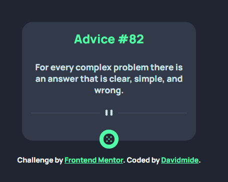

# Frontend Mentor - Advice generator app solution

This is a solution to the [Advice generator app challenge on Frontend Mentor](https://www.frontendmentor.io/challenges/advice-generator-app-QdUG-13db). Frontend Mentor challenges help you improve your coding skills by building realistic projects.

## Table of contents

- [Overview](#overview)
  - [The challenge](#the-challenge)
  - [Screenshot](#screenshot)
  - [Links](#links)
- [My process](#my-process)
  - [Built with](#built-with)
  - [What I learned](#what-i-learned)
  - [Continued development](#continued-development)
  - [Useful resources](#useful-resources)
- [Author](#author)
- [Acknowledgments](#acknowledgments)

## Overview

The project is to generate Advice per click from API

### The challenge

Users should be able to:

- View the optimal layout for the app depending on their device's screen size
- See hover states for all interactive elements on the page
- Generate a new piece of advice by clicking the dice icon

### Screenshot




### Links

- Solution URL: [Solution link](https://github.com/Davidmide02/advice-generator-app-main.git)
- Live Site URL: [Add live site URL here](https://your-live-site-url.com)

## My process
- Analysis the design
- Set the required
- Set html block need
- Styling
-The functionality, JS.

### Built with

- Semantic HTML5 markup
- CSS custom properties
- Flexbox
- Mobile-first workflow
- JavaScript

### What I learned

- Modern way to fetch API in JavaScript
- Possible error that could occur when working with API

```js
fetch()
.then(() => {
convert promise to normal data
})
.then (
  () =>
  {
    using the data returned
  }
).catch

```

### Continued development

- Add animation when generating the advices
- Light mode

### Useful resources

- [Google](https://www.google.com) 
- [stackoverflow](https://www.stackoverflow.com)


## Author

- Website - [Add your name here](https://www.your-site.com)
- Frontend Mentor - [@yourusername](https://www.frontendmentor.io/profile/Davidmide02)
- Twitter - [@yourusername](https://www.twitter.com/Davidmide02).